# Multi-Level User Management System (MEAN)

This system enforces strict parent–child hierarchy for user creation and balance flow.
Admin acts as a supervisory role without owning balance; all credits are deducted from the immediate parent.

A secure MEAN stack application demonstrating:
- JWT auth via **HttpOnly cookies**
- CAPTCHA-based login
- N-level user hierarchy (parent → child)
- Balance transfer (parent → direct child only)
- Transaction statements (credit/debit)
- Admin features: view users, downline tree, credit any user (deduct from parent), summary

## Tech Stack
- Backend: Node.js, Express, MongoDB (Mongoose)
- Frontend: Angular
- Auth: JWT + HttpOnly Cookies
- Validation: Zod
- Logging: Morgan

# OWNER

Owner Register

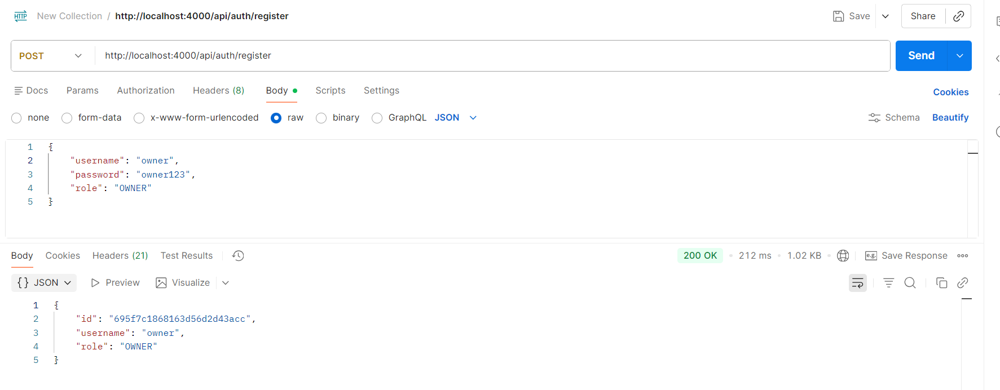

Owner Login

Owner Dashboard & seft Recharge here & transfer Monery by the Direct User Child & see the Statement

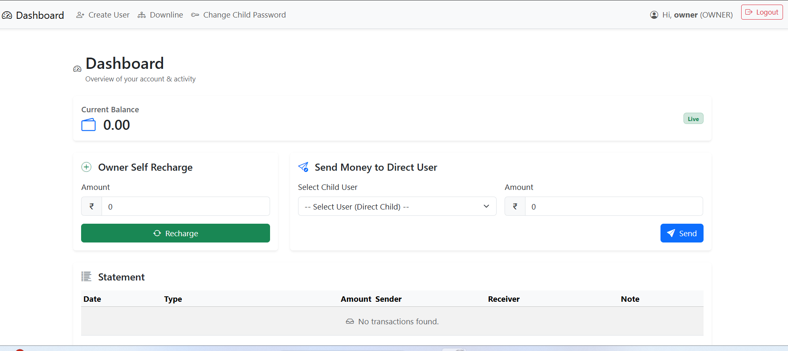

Owner Balance 

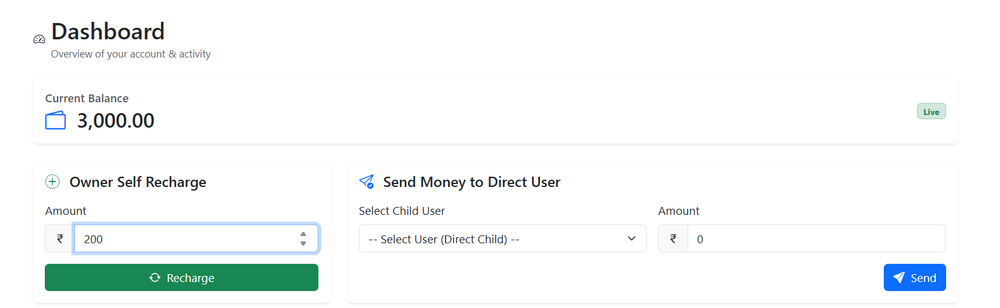

Owner can register the new User 

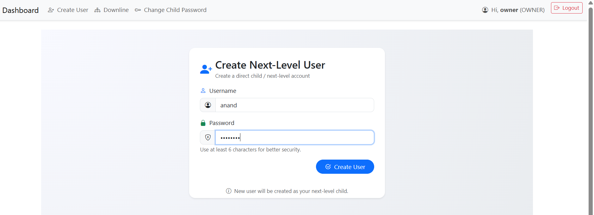

Owner can Send Money to Direct User

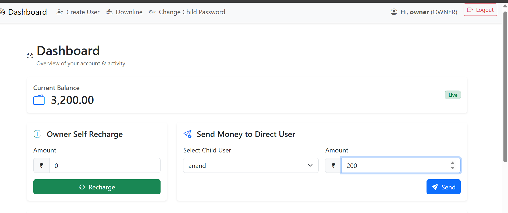

Owner See the Downline

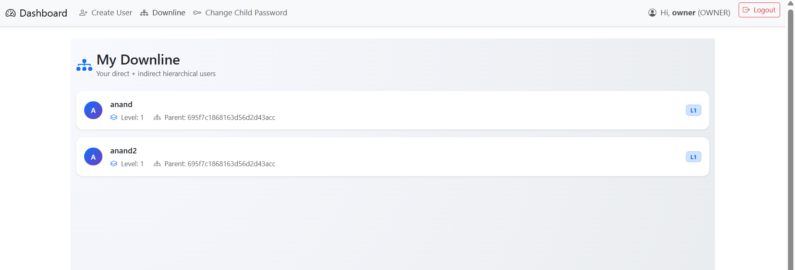

Owner Can change the password of next user 

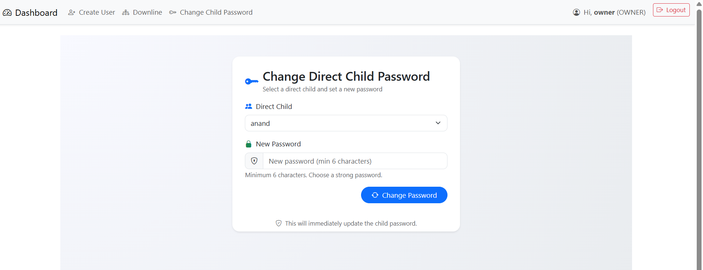

# ADMIN

Admin Register here 

admin login here

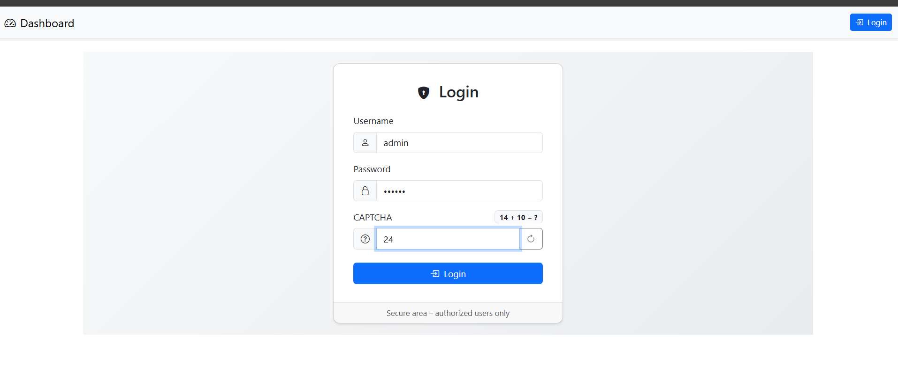

admin see the all users in level wise and admin can credit the balance

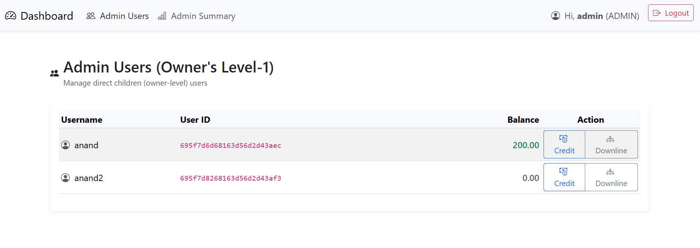

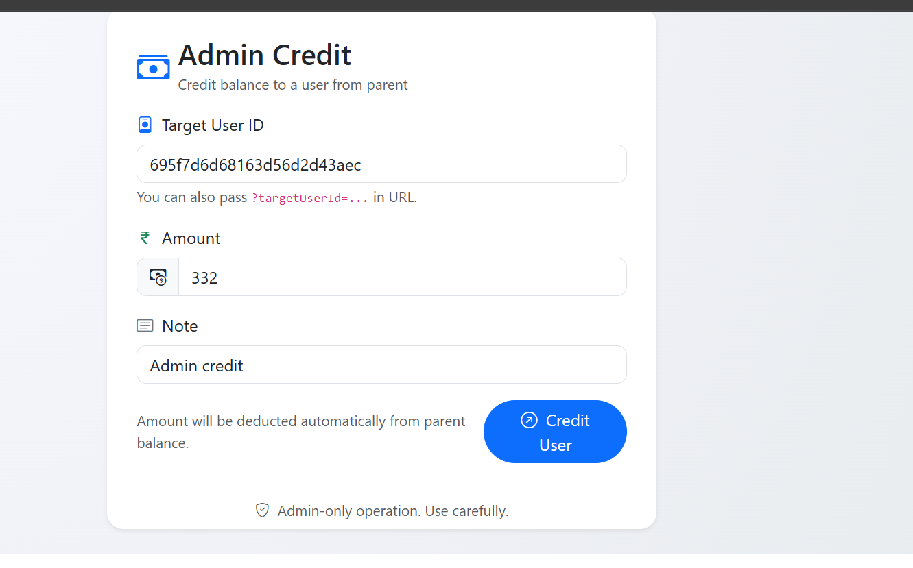

Admin can see the all donwline of User list 

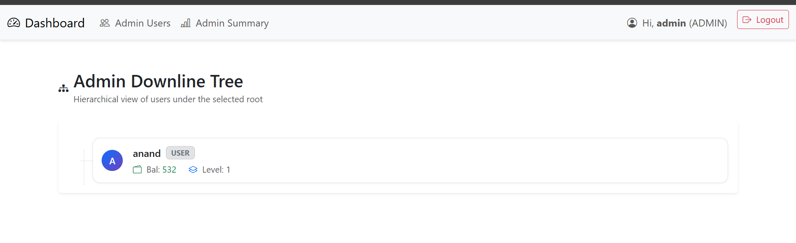

Admin Balance Summary

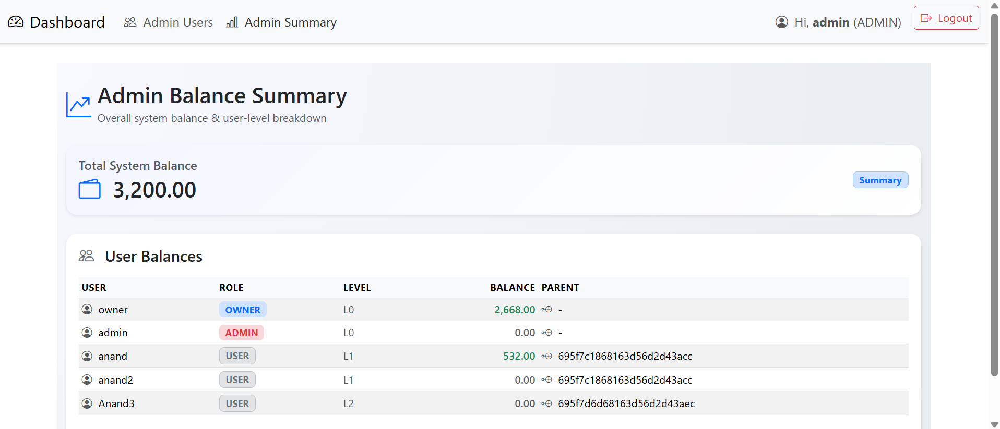